# 🧠 The Visual Deep Learning Companion
## A Philosophical & Diagrammatic Journey Through Goodfellow, Bengio & Courville

> *"The purpose of abstraction is not to be vague, but to create a new semantic level in which one can be absolutely precise."*
> — **Edsger Dijkstra**

---

## 📖 How to Use This Companion

This companion transforms dense mathematical concepts into **visual understanding**. Each chapter includes:

- **🎯 The Essential Insight** — One sentence that captures everything
- **🌳 Philosophical Roots** — Deep connections to epistemology, philosophy of mind, and human understanding
- **📊 Visual Diagrams** — Mermaid flowcharts, concept maps, and architecture diagrams
- **💡 The Feynman Test** — Can you explain it simply?
- **🏥 Healthcare Bridge** — Connections to medical AI applications

---

# PART I: Applied Mathematics and Machine Learning Basics

> *"Mathematics is the language with which God has written the universe."*
> — **Galileo Galilei**

---

## Chapter 1: Introduction — The Nature of Learning

### 🎯 The Essential Insight
**Deep learning discovers representations automatically, rather than requiring humans to design them.**

### 🌳 Philosophical Roots

> *"We are what we repeatedly do. Excellence, then, is not an act, but a habit."*
> — **Aristotle**

The ancient Greeks distinguished between **episteme** (scientific knowledge) and **techne** (craft knowledge). Traditional AI pursued episteme—explicit, rule-based knowledge. Deep learning embraces techne—the implicit knowledge that comes from practice, from seeing thousands of examples until patterns become instinct.

**Plato's Allegory of the Cave** offers another lens: traditional AI tries to describe shadows on the wall through rules. Deep learning learns to perceive the forms themselves—the underlying patterns that cast the shadows.

```mermaid
graph TB
    subgraph "The Evolution of AI"
        A[🏛️ Symbolic AI<br/>1950s-1980s] -->|"Knowledge Bottleneck"| B[📊 Machine Learning<br/>1980s-2000s]
        B -->|"Feature Engineering Bottleneck"| C[🧠 Deep Learning<br/>2006-Present]
    end
    
    subgraph "What Each Learns"
        A1[Rules written by humans] --> A
        B1[Patterns from human-designed features] --> B
        C1[Features AND patterns from raw data] --> C
    end
    
    style A fill:#e6f3ff,stroke:#333
    style B fill:#fff3e6,stroke:#333
    style C fill:#e6ffe6,stroke:#333
```

### 📊 The Three Waves of Neural Networks


### 💡 The Depth Hierarchy

> *"The whole is greater than the sum of its parts."*
> — **Aristotle**

```mermaid
graph LR
    subgraph "Layer 1: Edges"
        E1[—] 
        E2[ ]
        E3[|]
    end
    
    subgraph "Layer 2: Textures"
        T1[Fur]
        T2[Skin]
    end
    
    subgraph "Layer 3: Parts"
        P1[Eye]
        P2[Ear]
        P3[Nose]
    end
    
    subgraph "Layer 4: Objects"
        O1[🐱 Cat]
        O2[🐕 Dog]
    end
    
    E1 --> T1
    E2 --> T1
    E3 --> T2
    T1 --> P1
    T1 --> P2
    T2 --> P3
    P1 --> O1
    P2 --> O1
    P3 --> O2
    
    style O1 fill:#90EE90
    style O2 fill:#90EE90
```

**The Emergent Property**: Each layer learns representations that are meaningful for the task, but the COMBINATION creates understanding far beyond any single layer's capability.

### 🏥 Healthcare Bridge


---

## Chapter 2: Linear Algebra — The Language of Transformation

### 🎯 The Essential Insight
**Every neural network layer is a matrix multiplication followed by a nonlinearity. Master matrices, master deep learning.**

### 🌳 Philosophical Roots

> *"The book of nature is written in the language of mathematics."*
> — **Galileo Galilei**

Linear algebra embodies the philosophical concept of **transformation**—how things change while preserving essential structure. The Stoics spoke of *logos*—the rational principle governing transformation in the universe. Matrices ARE the logos of neural networks—they define how information transforms as it flows through layers.

**Leibniz's Dream**: Leibniz imagined a *characteristica universalis*—a universal symbolic language that could represent all human thought. Vectors and matrices come remarkably close: any piece of data (image, text, audio) becomes a vector; any transformation becomes a matrix.


### 📊 Vectors: Points in Meaning Space

> *"The map is not the territory."*
> — **Alfred Korzybski**

```mermaid
graph TB
    subgraph "A Vector is a Point"
        V1["[3, 4]"] --> P1[("• Point at (3,4)")]
    end
    
    subgraph "Data Becomes Vectors"
        I1[🖼️ Image 28×28] --> V2["784-dimensional vector"]
        T1[📝 Word 'king'] --> V3["300-dimensional embedding"]
        A1[🔊 Audio clip] --> V4["Spectrogram vector"]
    end
    
    subgraph "Vectors Live in Spaces"
        V2 --> S1[Image Space]
        V3 --> S2[Semantic Space]
        V4 --> S3[Audio Space]
    end
```

### 📊 Matrices: Transformation Machines

```mermaid
graph LR
    subgraph "Input Vector"
        I["[x₁, x₂]"]
    end
    
    subgraph "Matrix W"
        M["⎡a b⎤<br/>⎣c d⎦"]
    end
    
    subgraph "Output Vector"
        O["[y₁, y₂]"]
    end
    
    I -->|"Wx"| M
    M -->|"="| O
    
    subgraph "What the Matrix Does"
        T1[Rotate]
        T2[Scale]
        T3[Shear]
        T4[Project]
    end
    
    M --- T1
    M --- T2
    M --- T3
    M --- T4
```

### 📊 Eigendecomposition: The Soul of a Matrix

> *"Everything should be made as simple as possible, but not simpler."*
> — **Albert Einstein**

Eigenvectors reveal what a matrix **naturally wants to do**. They are the directions that remain unchanged (except for scaling) when the transformation is applied.

```mermaid
graph TB
    subgraph "Most Vectors Get Rotated"
        V1["→"] -->|"Apply Matrix"| V2["↗"]
    end
    
    subgraph "Eigenvectors Only Stretch"
        E1["→<br/>eigenvector"] -->|"Apply Matrix"| E2["——→<br/>λ × eigenvector"]
    end
    
    subgraph "Why This Matters"
        M1[PCA finds directions of maximum variance]
        M2[These ARE the eigenvectors of covariance]
        M3[Eigenvalues tell you how much variance]
    end
    
    E2 --> M1
    M1 --> M2
    M2 --> M3
    
    style E1 fill:#90EE90
    style E2 fill:#90EE90
```

### 📊 The Neural Network Layer as Matrix Operation

```mermaid
graph LR
    subgraph "Input Layer (3 neurons)"
        X1((x₁))
        X2((x₂))
        X3((x₃))
    end
    
    subgraph "Weight Matrix W"
        W["3×4 Matrix<br/>12 learnable parameters"]
    end
    
    subgraph "Hidden Layer (4 neurons)"
        H1((h₁))
        H2((h₂))
        H3((h₃))
        H4((h₄))
    end
    
    X1 --> W
    X2 --> W
    X3 --> W
    W --> H1
    W --> H2
    W --> H3
    W --> H4
    
    subgraph "The Equation"
        EQ["h = σ(Wx + b)"]
    end
```

### 💡 The Feynman Test

**Can you explain it to a child?**

"Imagine you have a machine with knobs. You put in a list of numbers, the machine multiplies and adds based on the knob settings, and out comes a new list of numbers. The knobs are the matrix. Learning is finding the right knob settings."

---

## Chapter 3: Probability & Information Theory — Embracing Uncertainty

### 🎯 The Essential Insight
**All of machine learning is fundamentally about modeling probability distributions from data.**

### 🌳 Philosophical Roots

> *"The only true wisdom is in knowing you know nothing."*
> — **Socrates**

The shift from classical logic (true/false) to probabilistic reasoning represents a profound philosophical evolution. **Bayesian epistemology** treats beliefs as probabilities, updated by evidence. This is exactly what neural networks do: they start with "prior" beliefs (random initialization) and update toward "posterior" beliefs (trained weights) based on data evidence.

> *"Probability is the very guide of life."*
> — **Cicero**

**David Hume's Problem of Induction**: How can we justify generalizing from observed cases to unobserved ones? Probability theory provides a rigorous framework: given what we've seen, what should we believe about what we haven't seen?

```mermaid
graph TB
    subgraph "Classical Logic"
        C1[Statement] --> C2{True or False?}
        C2 -->|True| C3[Certain Knowledge]
        C2 -->|False| C4[Certain Rejection]
    end
    
    subgraph "Probabilistic Reasoning"
        P1[Evidence] --> P2{Update Beliefs}
        P2 --> P3[Prior P(H)]
        P3 -->|"Bayes' Rule"| P4[Posterior P(H|E)]
        P4 --> P5[Degrees of Belief]
    end
    
    style P5 fill:#90EE90
```

### 📊 Bayes' Rule: The Master Equation

> *"When the facts change, I change my mind. What do you do, sir?"*
> — **John Maynard Keynes**

```mermaid
graph LR
    subgraph "Bayes' Theorem"
        B["P(H|E) = P(E|H) × P(H) / P(E)"]
    end
    
    subgraph "Components"
        C1["P(H|E)<br/>Posterior<br/>'What I believe now'"]
        C2["P(E|H)<br/>Likelihood<br/>'How well data fits hypothesis'"]
        C3["P(H)<br/>Prior<br/>'What I believed before'"]
        C4["P(E)<br/>Evidence<br/>'How surprising is this data'"]
    end
    
    B --> C1
    B --> C2
    B --> C3
    B --> C4
```

### 📊 Information Theory: Quantifying Surprise

> *"Information is the resolution of uncertainty."*
> — **Claude Shannon**

```mermaid
graph TB
    subgraph "Shannon Entropy"
        S1["H(X) = -Σ p(x) log p(x)"]
        S2[Measures average surprise]
        S3[Higher entropy = more uncertainty]
    end
    
    subgraph "Examples"
        E1["Fair coin: H = 1 bit<br/>Maximum uncertainty"]
        E2["Biased coin (99% heads): H ≈ 0.08 bits<br/>Low uncertainty"]
        E3["Always heads: H = 0 bits<br/>No uncertainty"]
    end
    
    S1 --> S2
    S2 --> S3
    S3 --> E1
    S3 --> E2
    S3 --> E3
    
    style E1 fill:#ffcccc
    style E2 fill:#ffffcc
    style E3 fill:#ccffcc
```

### 📊 Cross-Entropy Loss: The Learning Signal

```mermaid
graph TB
    subgraph "Cross-Entropy Loss"
        CE["L = -Σ y_true × log(y_pred)"]
    end
    
    subgraph "Intuition"
        I1[Measures 'surprise' of predictions]
        I2[Low loss = predictions match reality]
        I3[High loss = predictions are surprising/wrong]
    end
    
    subgraph "Why It Works"
        W1[Gradient pushes predictions toward truth]
        W2[Confident wrong predictions penalized heavily]
        W3[Information-theoretically optimal]
    end
    
    CE --> I1
    I1 --> I2
    I2 --> I3
    I3 --> W1
    W1 --> W2
    W2 --> W3
```

### 🏥 Healthcare Bridge

```mermaid
graph LR
    subgraph "Diagnostic Uncertainty"
        D1[Patient Symptoms] --> D2[P(Disease | Symptoms)]
        D2 --> D3[Confidence Interval]
        D3 --> D4[Clinical Decision]
    end
    
    subgraph "Why Probability Matters"
        P1["Don't say: 'You have cancer'"]
        P2["Say: '85% probability of malignancy'"]
        P3[Enables informed consent]
        P4[Supports shared decision-making]
    end
    
    D4 --> P1
    P1 --> P2
    P2 --> P3
    P3 --> P4
    
    style P4 fill:#90EE90
```

---

## Chapter 4: Numerical Computation — The Art of Approximation

### 🎯 The Essential Insight
**Deep learning is optimization: finding the needle (optimal parameters) in an astronomically large haystack (parameter space).**

### 🌳 Philosophical Roots

> *"Nature does nothing in vain, and more is in vain when less will serve."*
> — **Isaac Newton**

The principle of **parsimony** (Occam's Razor) underlies optimization. Among all possible solutions, we seek the simplest that explains the data. Gradient descent embodies this: take the path of steepest descent toward simplicity (lower loss).

> *"The essence of mathematics is not to make simple things complicated, but to make complicated things simple."*
> — **Stan Gudder**

**Zeno's Paradoxes** anticipated the challenges of optimization: How can you reach a goal through infinitely many small steps? Calculus resolved this philosophically; gradient descent resolves it computationally.

### 📊 Gradient Descent: Following the Slope

```mermaid
graph TB
    subgraph "The Loss Landscape"
        L1[🏔️ High Loss<br/>Bad Parameters]
        L2[⛰️ Local Minimum<br/>Okay Parameters]
        L3[🏞️ Global Minimum<br/>Optimal Parameters]
    end
    
    subgraph "Gradient Descent"
        G1[Start at random point]
        G2[Compute gradient ∇L]
        G3[Step opposite to gradient]
        G4[Repeat until convergence]
    end
    
    G1 --> G2
    G2 --> G3
    G3 --> G4
    G4 -->|"Not converged"| G2
    G4 -->|"Converged"| L3
    
    L1 -->|"Gradient points uphill"| L2
    L2 -->|"Gradient points uphill"| L3
    
    style L3 fill:#90EE90
```

### 📊 Learning Rate: The Step Size Dilemma

```mermaid
graph TB
    subgraph "Learning Rate Too Small"
        S1[🐌 Tiny steps]
        S2[Takes forever to converge]
        S3[May get stuck]
    end
    
    subgraph "Learning Rate Too Large"
        L1[🚀 Giant leaps]
        L2[Overshoots minimum]
        L3[May diverge!]
    end
    
    subgraph "Learning Rate Just Right"
        J1[🎯 Balanced steps]
        J2[Efficient convergence]
        J3[Finds good minimum]
    end
    
    S1 --> S2 --> S3
    L1 --> L2 --> L3
    J1 --> J2 --> J3
    
    style J3 fill:#90EE90
    style L3 fill:#ffcccc
```

### 📊 The Chain Rule: Backpropagation's Heart

> *"In mathematics, you don't understand things. You just get used to them."*
> — **John von Neumann**

```mermaid
graph LR
    subgraph "Forward Pass"
        X[Input x] -->|"f"| H1[Hidden h₁]
        H1 -->|"g"| H2[Hidden h₂]
        H2 -->|"L"| Loss[Loss ℓ]
    end
    
    subgraph "Backward Pass (Chain Rule)"
        Loss -->|"∂ℓ/∂h₂"| H2
        H2 -->|"∂h₂/∂h₁"| H1
        H1 -->|"∂h₁/∂x"| X
    end
    
    subgraph "The Magic"
        M1["∂ℓ/∂x = (∂ℓ/∂h₂)(∂h₂/∂h₁)(∂h₁/∂x)"]
        M2[Multiply local gradients]
        M3[Propagate error backward]
    end
    
    style M1 fill:#e6f3ff
```

---

## Chapter 5: Machine Learning Basics — The Foundation

### 🎯 The Essential Insight
**The goal is not to fit training data perfectly, but to generalize to unseen data. This tension defines all of machine learning.**

### 🌳 Philosophical Roots

> *"The only source of knowledge is experience."*
> — **Albert Einstein**

The **bias-variance tradeoff** echoes ancient philosophical tensions:
- **Rationalism** (high bias): Strong prior assumptions, consistent but possibly wrong
- **Empiricism** (high variance): Learn everything from data, flexible but possibly overfit

The ideal learner, like Aristotle's virtuous person, finds the **golden mean** between these extremes.

> *"It is the mark of an educated mind to be able to entertain a thought without accepting it."*
> — **Aristotle**

Machine learning embodies **fallibilism**—the philosophical position that knowledge claims are never certain but can be improved through experience. Every model is provisional, updated as new data arrives.

### 📊 The Bias-Variance Tradeoff


### 📊 Visual: The Fitting Spectrum

```mermaid
graph LR
    subgraph "Underfitting"
        U1["📉 High Training Error"]
        U2["📉 High Test Error"]
        U3["Simple model misses patterns"]
    end
    
    subgraph "Good Fit"
        G1["📈 Low Training Error"]
        G2["📈 Low Test Error"]
        G3["Model captures signal, ignores noise"]
    end
    
    subgraph "Overfitting"
        O1["📈 Very Low Training Error"]
        O2["📉 High Test Error"]
        O3["Model memorized training data"]
    end
    
    U1 --> U2 --> U3
    G1 --> G2 --> G3
    O1 --> O2 --> O3
    
    U3 -->|"Increase complexity"| G3
    G3 -->|"Too much complexity"| O3
    
    style G3 fill:#90EE90
```

### 📊 Train-Validation-Test Split


---

# PART II: Deep Networks — Modern Practices

> *"Simplicity is the ultimate sophistication."*
> — **Leonardo da Vinci**

---

## Chapter 6: Deep Feedforward Networks — The Workhorse

### 🎯 The Essential Insight
**Hidden layers learn representations. The network discovers WHAT features to extract, not just HOW to combine them.**

### 🌳 Philosophical Roots

> *"The important thing is not to stop questioning. Curiosity has its own reason for existing."*
> — **Albert Einstein**

Deep networks embody **emergent properties**—complex behaviors arising from simple components. This echoes the philosophical concept of **supervenience**: mental states supervene on physical brain states; similarly, abstract concepts (like "cat-ness") supervene on patterns of neural activations.

> *"The whole is greater than the sum of its parts."*
> — **Aristotle, Metaphysics**

**Gestalt psychology** anticipated deep learning: perception isn't built from atomic sensations but from holistic patterns. Each layer of a network performs a kind of Gestalt grouping, combining lower-level patterns into higher-level wholes.

### 📊 The Architecture of Understanding

```mermaid
graph TB
    subgraph "Input Layer"
        I1((x₁))
        I2((x₂))
        I3((x₃))
        I4((x₄))
    end
    
    subgraph "Hidden Layer 1: Features"
        H1((h₁))
        H2((h₂))
        H3((h₃))
    end
    
    subgraph "Hidden Layer 2: Concepts"
        C1((c₁))
        C2((c₂))
    end
    
    subgraph "Output Layer"
        O1((ŷ))
    end
    
    I1 --> H1
    I1 --> H2
    I1 --> H3
    I2 --> H1
    I2 --> H2
    I2 --> H3
    I3 --> H1
    I3 --> H2
    I3 --> H3
    I4 --> H1
    I4 --> H2
    I4 --> H3
    
    H1 --> C1
    H1 --> C2
    H2 --> C1
    H2 --> C2
    H3 --> C1
    H3 --> C2
    
    C1 --> O1
    C2 --> O1
    
    style H1 fill:#e6f3ff
    style H2 fill:#e6f3ff
    style H3 fill:#e6f3ff
    style C1 fill:#fff3e6
    style C2 fill:#fff3e6
```

### 📊 The XOR Problem: Why Depth Matters

> *"Problems cannot be solved at the same level of awareness that created them."*
> — **Albert Einstein**

```mermaid
graph TB
    subgraph "XOR Truth Table"
        T1["(0,0) → 0"]
        T2["(0,1) → 1"]
        T3["(1,0) → 1"]
        T4["(1,1) → 0"]
    end
    
    subgraph "The Problem"
        P1["No single line can separate<br/>the 1s from the 0s"]
        P2["XOR is NOT linearly separable"]
    end
    
    subgraph "The Solution: Hidden Layer"
        S1["First layer TRANSFORMS the space"]
        S2["In new space, points ARE separable"]
        S3["Second layer draws the line"]
    end
    
    T1 --> P1
    T2 --> P1
    T3 --> P1
    T4 --> P1
    P1 --> P2
    P2 --> S1
    S1 --> S2
    S2 --> S3
    
    style S3 fill:#90EE90
```

### 📊 Activation Functions: The Nonlinear Secret

> *"Life can only be understood backwards; but it must be lived forwards."*
> — **Søren Kierkegaard**

Without nonlinearity, stacking layers collapses to a single linear transformation. Activations introduce the **creative destruction** that enables learning.

```mermaid
graph TB
    subgraph "Why Nonlinearity?"
        W1["Linear(Linear(x)) = Linear(x)"]
        W2["Stacking linear layers = ONE linear layer"]
        W3["Can only draw straight decision boundaries"]
    end
    
    subgraph "Activation Functions"
        A1["ReLU: max(0, x)<br/>Simple, fast, default choice"]
        A2["Sigmoid: 1/(1+e⁻ˣ)<br/>Squashes to (0,1)"]
        A3["Tanh: (eˣ-e⁻ˣ)/(eˣ+e⁻ˣ)<br/>Squashes to (-1,1)"]
    end
    
    subgraph "The Magic"
        M1["With nonlinearity:"]
        M2["Can approximate ANY function"]
        M3["Universal Approximation Theorem"]
    end
    
    W1 --> W2 --> W3
    W3 -->|"Add activation"| A1
    A1 --> M1
    M1 --> M2
    M2 --> M3
    
    style M3 fill:#90EE90
```

### 📊 ReLU: The Surprisingly Powerful Simple Function

```mermaid
graph LR
    subgraph "ReLU Definition"
        R["ReLU(x) = max(0, x)"]
    end
    
    subgraph "Properties"
        P1["✅ Fast to compute"]
        P2["✅ Sparse activations"]
        P3["✅ No vanishing gradient (for x>0)"]
        P4["⚠️ Dead neurons (if x<0 always)"]
    end
    
    subgraph "Visual"
        V["x < 0: output 0 (off)<br/>x ≥ 0: output x (linear)"]
    end
    
    R --> P1
    R --> P2
    R --> P3
    R --> P4
    R --> V
```

### 📊 Backpropagation: The Learning Algorithm

> *"The secret of change is to focus all of your energy not on fighting the old, but on building the new."*
> — **Socrates**

```mermaid
graph TB
    subgraph "Forward Pass"
        FP1["Input → Hidden → Output"]
        FP2["Compute predictions"]
        FP3["Calculate loss"]
    end
    
    subgraph "Backward Pass"
        BP1["Start from loss"]
        BP2["Compute gradients layer by layer"]
        BP3["Use chain rule: ∂L/∂w = ∂L/∂y × ∂y/∂w"]
    end
    
    subgraph "Update"
        U1["w_new = w_old - η × ∂L/∂w"]
        U2["η = learning rate"]
        U3["Repeat until convergence"]
    end
    
    FP1 --> FP2 --> FP3
    FP3 --> BP1
    BP1 --> BP2 --> BP3
    BP3 --> U1
    U1 --> U2 --> U3
    U3 -->|"Not converged"| FP1
    
    style U3 fill:#90EE90
```

### 🏥 Healthcare Application: Diabetic Retinopathy

```mermaid
graph TB
    subgraph "Input"
        I[Retinal Image<br/>512×512 pixels]
    end
    
    subgraph "Layer 1: Low-Level"
        L1["Detects edges, spots, vessels"]
    end
    
    subgraph "Layer 2: Mid-Level"
        L2["Detects hemorrhages, exudates"]
    end
    
    subgraph "Layer 3: High-Level"
        L3["Detects patterns of damage"]
    end
    
    subgraph "Output"
        O["Severity Grade 0-4"]
    end
    
    I --> L1 --> L2 --> L3 --> O
    
    subgraph "Clinical Impact"
        C1["Ophthalmologist-level accuracy"]
        C2["Enables screening at scale"]
        C3["Earlier intervention"]
    end
    
    O --> C1 --> C2 --> C3
    
    style C3 fill:#90EE90
```

---

## Chapter 7: Regularization — The Art of Restraint

### 🎯 The Essential Insight
**Regularization trades training accuracy for generalization. It's better to be roughly right than precisely wrong.**

### 🌳 Philosophical Roots

> *"Perfection is achieved, not when there is nothing more to add, but when there is nothing left to take away."*
> — **Antoine de Saint-Exupéry**

Regularization embodies **epistemological humility**—the recognition that our models might be wrong, and that certainty should be penalized. It echoes the philosophical virtue of **sophrosyne** (moderation) praised by the Greeks.

> *"The first principle is that you must not fool yourself—and you are the easiest person to fool."*
> — **Richard Feynman**

**Occam's Razor** (entities should not be multiplied beyond necessity) is regularization's philosophical foundation. L1/L2 penalties literally penalize model complexity, preferring simpler explanations.

### 📊 The Overfitting Trap

```mermaid
graph TB
    subgraph "Training Data"
        T1["• • • (data points)"]
        T2["Some points are noise"]
        T3["Some points are signal"]
    end
    
    subgraph "Overfit Model"
        O1["Wiggly curve through ALL points"]
        O2["Memorized noise"]
        O3["Will fail on new data"]
    end
    
    subgraph "Regularized Model"
        R1["Smooth curve through TREND"]
        R2["Ignored noise"]
        R3["Will generalize well"]
    end
    
    T1 --> T2 --> T3
    T3 -->|"No regularization"| O1
    T3 -->|"With regularization"| R1
    O1 --> O2 --> O3
    R1 --> R2 --> R3
    
    style O3 fill:#ffcccc
    style R3 fill:#90EE90
```

### 📊 L1 vs L2 Regularization

```mermaid
graph TB
    subgraph "L2 Regularization (Ridge)"
        L2a["Penalty: λ × Σw²"]
        L2b["Shrinks weights toward zero"]
        L2c["But rarely exactly zero"]
        L2d["Smooth, stable solutions"]
    end
    
    subgraph "L1 Regularization (Lasso)"
        L1a["Penalty: λ × Σ|w|"]
        L1b["Shrinks weights toward zero"]
        L1c["Often exactly zero"]
        L1d["Sparse solutions (feature selection)"]
    end
    
    subgraph "When to Use"
        W1["L2: When all features matter some"]
        W2["L1: When you want feature selection"]
        W3["Elastic Net: Combine both"]
    end
    
    L2a --> L2b --> L2c --> L2d
    L1a --> L1b --> L1c --> L1d
    L2d --> W1
    L1d --> W2
    W1 --> W3
    W2 --> W3
```

### 📊 Dropout: Training an Ensemble

> *"United we stand, divided we fall."*
> — **Aesop**

```mermaid
graph TB
    subgraph "Standard Training"
        S1["All neurons active"]
        S2["Network can rely on any neuron"]
        S3["Risk: Co-adaptation"]
    end
    
    subgraph "Dropout Training"
        D1["Randomly drop 50% of neurons"]
        D2["Each training step = different sub-network"]
        D3["No neuron can be indispensable"]
    end
    
    subgraph "Result"
        R1["Each neuron learns robust features"]
        R2["Implicit ensemble of 2ⁿ networks"]
        R3["Better generalization"]
    end
    
    S1 --> S2 --> S3
    D1 --> D2 --> D3
    D3 --> R1 --> R2 --> R3
    
    style R3 fill:#90EE90
```

### 📊 Data Augmentation: Creating Wisdom from Examples

```mermaid
graph LR
    subgraph "Original Image"
        O["🖼️ Cat photo"]
    end
    
    subgraph "Augmentations"
        A1["🔄 Rotated"]
        A2["🔍 Zoomed"]
        A3["↔️ Flipped"]
        A4["🌈 Color shifted"]
        A5["✂️ Cropped"]
    end
    
    subgraph "Benefit"
        B1["5x more training data"]
        B2["Network learns: cat = cat<br/>regardless of orientation"]
        B3["Built-in invariances"]
    end
    
    O --> A1
    O --> A2
    O --> A3
    O --> A4
    O --> A5
    A1 --> B1
    A2 --> B1
    A3 --> B1
    A4 --> B1
    A5 --> B1
    B1 --> B2 --> B3
```

---

## Chapter 8: Optimization — The Journey to Minimum

### 🎯 The Essential Insight
**Training neural networks is navigating a high-dimensional landscape. The path you take matters as much as the destination.**

### 🌳 Philosophical Roots

> *"The journey of a thousand miles begins with a single step."*
> — **Lao Tzu**

Gradient descent is a form of **process philosophy**—the belief that reality is fundamentally about processes and change, not static states. The network IS its training trajectory, not just its final weights.

> *"You cannot step into the same river twice."*
> — **Heraclitus**

The loss landscape is Heraclitean: always changing as batch samples vary. **Stochastic** gradient descent embraces this flux, finding robustness through variation rather than despite it.

### 📊 The Optimization Landscape

```mermaid
graph TB
    subgraph "Landscape Features"
        L1["🏔️ Global Maximum (Worst)"]
        L2["⛰️ Local Maximum (Bad)"]
        L3["🏞️ Saddle Point (Trap)"]
        L4["⛰️ Local Minimum (Okay)"]
        L5["🏞️ Global Minimum (Goal)"]
    end
    
    subgraph "Challenges"
        C1["Many local minima"]
        C2["Saddle points (flat regions)"]
        C3["Ravines (steep in one direction)"]
        C4["Plateaus (near-zero gradient)"]
    end
    
    L1 --> C1
    L3 --> C2
    L4 --> C3
    L4 --> C4
```

### 📊 SGD vs Batch vs Mini-Batch

```mermaid
graph TB
    subgraph "Batch Gradient Descent"
        B1["Use ALL data for each update"]
        B2["✅ Stable gradients"]
        B3["❌ Slow, needs lots of memory"]
        B4["❌ Can get stuck in local minima"]
    end
    
    subgraph "Stochastic GD (SGD)"
        S1["Use ONE sample per update"]
        S2["✅ Fast updates, escapes local minima"]
        S3["❌ Very noisy gradients"]
        S4["❌ Doesn't use parallelism well"]
    end
    
    subgraph "Mini-Batch GD"
        M1["Use 32-512 samples per update"]
        M2["✅ Balanced noise/stability"]
        M3["✅ Parallelizes well on GPUs"]
        M4["⭐ The standard choice"]
    end
    
    B1 --> B2 --> B3 --> B4
    S1 --> S2 --> S3 --> S4
    M1 --> M2 --> M3 --> M4
    
    style M4 fill:#90EE90
```

### 📊 Adam: The Adaptive Optimizer

```mermaid
graph TB
    subgraph "The Problem with SGD"
        P1["Same learning rate for all parameters"]
        P2["Doesn't adapt to gradient history"]
        P3["Struggles with sparse gradients"]
    end
    
    subgraph "Adam's Solution"
        A1["Momentum: Remember past gradients"]
        A2["RMSprop: Adapt learning rate per parameter"]
        A3["Bias correction: Handle early training"]
    end
    
    subgraph "The Formula"
        F1["m = β₁m + (1-β₁)∇L<br/>(momentum)"]
        F2["v = β₂v + (1-β₂)(∇L)²<br/>(adaptive scaling)"]
        F3["θ = θ - η × m̂/√(v̂ + ε)"]
    end
    
    P1 --> A2
    P2 --> A1
    P3 --> A2
    A1 --> F1
    A2 --> F2
    F1 --> F3
    F2 --> F3
    
    style F3 fill:#90EE90
```

### 📊 Learning Rate Schedules

```mermaid
graph LR
    subgraph "Constant LR"
        C["η = 0.001 always"]
    end
    
    subgraph "Step Decay"
        S["η = 0.1 → 0.01 → 0.001<br/>at epochs 30, 60, 90"]
    end
    
    subgraph "Cosine Annealing"
        A["η starts high, smoothly<br/>decays to near-zero"]
    end
    
    subgraph "Warmup + Decay"
        W["η: 0 → max → decay<br/>Popular for Transformers"]
    end
    
    C -->|"Simple but suboptimal"| S
    S -->|"Requires tuning epochs"| A
    A -->|"Smooth, no hyperparams"| W
    
    style W fill:#90EE90
```

---

## Chapter 9: Convolutional Networks — Learning to See

### 🎯 The Essential Insight
**CNNs exploit spatial structure: the same pattern can appear anywhere in an image, so share the detector weights.**

### 🌳 Philosophical Roots

> *"The eye sees only what the mind is prepared to comprehend."*
> — **Robertson Davies**

The visual system demonstrates **hierarchical abstraction**—the same principle underlying Plato's theory of Forms. We perceive a chair not as pixels or edges, but as an instance of the Form "chair." CNNs learn these hierarchical abstractions automatically.

> *"In the depth of winter, I finally learned that within me there lay an invincible summer."*
> — **Albert Camus**

CNNs embody **locality**—the philosophical principle that effects have local causes. A pixel's meaning depends on its neighbors, not distant pixels. This is visual epistemology: knowledge built from local relationships.

### 📊 The Convolution Operation

```mermaid
graph LR
    subgraph "Input Image"
        I["5×5 pixel grid"]
    end
    
    subgraph "Kernel/Filter"
        K["3×3 pattern detector"]
    end
    
    subgraph "Operation"
        O1["Slide kernel across image"]
        O2["At each position: element-wise multiply"]
        O3["Sum the products = one output pixel"]
    end
    
    subgraph "Output Feature Map"
        F["3×3 feature map<br/>High values = kernel pattern found"]
    end
    
    I --> O1
    K --> O1
    O1 --> O2 --> O3 --> F
```

### 📊 What Kernels Detect

```mermaid
graph TB
    subgraph "Edge Detection Kernels"
        E1["Horizontal edges:<br/>-1 -1 -1<br/> 0  0  0<br/> 1  1  1"]
        E2["Vertical edges:<br/>-1 0 1<br/>-1 0 1<br/>-1 0 1"]
    end
    
    subgraph "Other Patterns"
        P1["Corners"]
        P2["Textures"]
        P3["Gradients"]
    end
    
    subgraph "Key Insight"
        K1["Networks LEARN their own kernels"]
        K2["No hand-engineering needed"]
        K3["Often discover patterns humans missed"]
    end
    
    E1 --> K1
    E2 --> K1
    P1 --> K2
    P2 --> K2
    P3 --> K2
    K1 --> K3
    
    style K3 fill:#90EE90
```

### 📊 CNN Architecture: The Visual Hierarchy

```mermaid
graph TB
    subgraph "Input"
        I["224×224×3<br/>RGB Image"]
    end
    
    subgraph "Conv Block 1"
        C1["64 filters, 3×3"]
        P1["Max Pool 2×2"]
        O1["112×112×64"]
    end
    
    subgraph "Conv Block 2"
        C2["128 filters, 3×3"]
        P2["Max Pool 2×2"]
        O2["56×56×128"]
    end
    
    subgraph "Conv Block 3"
        C3["256 filters, 3×3"]
        P3["Max Pool 2×2"]
        O3["28×28×256"]
    end
    
    subgraph "Fully Connected"
        FC["Flatten → Dense → Output"]
    end
    
    I --> C1 --> P1 --> O1
    O1 --> C2 --> P2 --> O2
    O2 --> C3 --> P3 --> O3
    O3 --> FC
    
    subgraph "What Each Block Learns"
        L1["Block 1: Edges, colors"]
        L2["Block 2: Textures, patterns"]
        L3["Block 3: Parts, objects"]
    end
    
    O1 --- L1
    O2 --- L2
    O3 --- L3
```

### 📊 Pooling: Summarizing Regions

```mermaid
graph LR
    subgraph "Input Region"
        I["4 2<br/>1 3"]
    end
    
    subgraph "Max Pooling"
        M["4<br/>(keep maximum)"]
    end
    
    subgraph "Average Pooling"
        A["2.5<br/>(take average)"]
    end
    
    subgraph "Benefits"
        B1["Reduces spatial size"]
        B2["Introduces translation invariance"]
        B3["Reduces computation"]
    end
    
    I --> M
    I --> A
    M --> B1
    A --> B1
    B1 --> B2 --> B3
```

### 📊 Famous CNN Architectures

```mermaid
timeline
    title Evolution of CNN Architectures
    
    section Early Era
        1998 : LeNet-5 (LeCun)
             : 5 layers, digit recognition
    
    section ImageNet Era
        2012 : AlexNet
             : 8 layers, ReLU, dropout
        2014 : VGGNet
             : 19 layers, 3×3 kernels only
        2014 : GoogLeNet/Inception
             : 22 layers, inception modules
    
    section Residual Era
        2015 : ResNet
             : 152 layers! Skip connections
        2017 : DenseNet
             : Dense connections
    
    section Efficient Era
        2019 : EfficientNet
             : Compound scaling
        2020 : Vision Transformer (ViT)
             : Attention-based vision
```

### 📊 ResNet: Skip Connections

> *"The obstacle is the way."*
> — **Marcus Aurelius**

```mermaid
graph TB
    subgraph "The Problem: Vanishing Gradients"
        P1["Deep networks (50+ layers)"]
        P2["Gradients shrink exponentially"]
        P3["Early layers stop learning"]
    end
    
    subgraph "ResNet Solution: Skip Connections"
        X["Input x"]
        F["F(x) = Conv layers"]
        A["Add: F(x) + x"]
        O["Output"]
        
        X --> F --> A
        X -->|"Skip connection"| A
        A --> O
    end
    
    subgraph "Why It Works"
        W1["Learning: ΔF(x) = H(x) - x"]
        W2["Learn the RESIDUAL, not the mapping"]
        W3["Identity path preserves gradients"]
    end
    
    P1 --> P2 --> P3
    P3 -->|"Solved by"| A
    A --> W1 --> W2 --> W3
    
    style W3 fill:#90EE90
```

### 🏥 Healthcare Application: Medical Imaging

```mermaid
graph TB
    subgraph "Applications"
        A1["🫁 Chest X-rays<br/>COVID, pneumonia, TB"]
        A2["🔬 Pathology<br/>Cancer cell detection"]
        A3["👁️ Retinal imaging<br/>Diabetic retinopathy"]
        A4["🧠 Brain MRI<br/>Tumor segmentation"]
        A5["💔 Cardiac imaging<br/>Ejection fraction"]
    end
    
    subgraph "Why CNNs Excel"
        W1["Learn from pixels directly"]
        W2["No manual feature engineering"]
        W3["Transfer learning from ImageNet"]
    end
    
    subgraph "Clinical Impact"
        C1["Radiologist-level accuracy"]
        C2["24/7 availability"]
        C3["Consistent interpretation"]
        C4["Triage and prioritization"]
    end
    
    A1 --> W1
    A2 --> W2
    A3 --> W3
    W1 --> C1
    W2 --> C2
    W3 --> C3
    C1 --> C4
    
    style C4 fill:#90EE90
```

---

## Chapter 10: Sequence Modeling — Memory and Time

### 🎯 The Essential Insight
**RNNs add memory to neural networks, enabling processing of sequences where order matters: language, time series, patient histories.**

### 🌳 Philosophical Roots

> *"Time is the moving image of eternity."*
> — **Plato**

Sequential data embodies **temporal epistemology**—knowledge that depends on when things happen and in what order. The meaning of "I love you" depends on whether it follows "I hate you" or "I've always felt..."

> *"Memory is the diary that we all carry about with us."*
> — **Oscar Wilde**

RNNs implement **narrative understanding**—the human capacity to integrate events into a coherent story. Each hidden state is a summary of "the story so far," updated as new events unfold.

### 📊 RNN: The Feedback Loop

```mermaid
graph TB
    subgraph "Unrolled RNN"
        X1["x₁"] --> H1["h₁"]
        X2["x₂"] --> H2["h₂"]
        X3["x₃"] --> H3["h₃"]
        X4["x₄"] --> H4["h₄"]
        
        H1 -->|"Memory"| H2
        H2 -->|"Memory"| H3
        H3 -->|"Memory"| H4
        
        H1 --> Y1["y₁"]
        H2 --> Y2["y₂"]
        H3 --> Y3["y₃"]
        H4 --> Y4["y₄"]
    end
    
    subgraph "The Equation"
        E["hₜ = tanh(Wₓxₜ + Wₕhₜ₋₁ + b)"]
    end
    
    subgraph "Same Weights at Every Step"
        W1["W_x, W_h, W_y are SHARED"]
        W2["Learns a PROCESS, not just a mapping"]
    end
```

### 📊 The Vanishing Gradient Problem

> *"What we learn with pleasure we never forget."*
> — **Alfred Mercier**

```mermaid
graph TB
    subgraph "Forward Pass"
        F1["h₁"] --> F2["h₂"] --> F3["h₃"] --> F4["..."] --> F5["h₁₀₀"]
    end
    
    subgraph "Backward Pass"
        B1["∂L/∂h₁₀₀"] --> B2["..."] --> B3["∂L/∂h₃"] --> B4["∂L/∂h₂"] --> B5["∂L/∂h₁"]
    end
    
    subgraph "The Problem"
        P1["Gradient = product of many small numbers"]
        P2["(0.9)¹⁰⁰ ≈ 0.00003"]
        P3["Early states get negligible updates"]
        P4["Network 'forgets' distant past"]
    end
    
    F5 --> B1
    B5 --> P1 --> P2 --> P3 --> P4
    
    style P4 fill:#ffcccc
```

### 📊 LSTM: The Memory Cell

> *"The true art of memory is the art of attention."*
> — **Samuel Johnson**

```mermaid
graph TB
    subgraph "LSTM Cell"
        subgraph "Gates"
            F["🚪 Forget Gate<br/>What to discard"]
            I["🚪 Input Gate<br/>What to remember"]
            O["🚪 Output Gate<br/>What to reveal"]
        end
        
        subgraph "Cell State"
            C["📦 Cell State<br/>(Long-term memory)"]
        end
        
        subgraph "Hidden State"
            H["💭 Hidden State<br/>(Working memory)"]
        end
    end
    
    F -->|"Controls"| C
    I -->|"Updates"| C
    C -->|"Filtered by"| O
    O -->|"Produces"| H
    
    subgraph "Key Insight"
        K1["Gates learn WHEN to remember/forget"]
        K2["Cell state flows with minimal transformation"]
        K3["Gradients preserved over long sequences"]
    end
    
    style C fill:#90EE90
```

### 📊 LSTM Gate Equations Visualized

```mermaid
graph LR
    subgraph "Inputs at time t"
        X["xₜ (current input)"]
        H["hₜ₋₁ (previous hidden)"]
    end
    
    subgraph "Forget Gate"
        F["fₜ = σ(Wf·[hₜ₋₁, xₜ] + bf)"]
        F1["Outputs 0-1 for each cell element"]
        F2["0 = forget, 1 = remember"]
    end
    
    subgraph "Input Gate"
        I["iₜ = σ(Wi·[hₜ₋₁, xₜ] + bi)"]
        C_tilde["c̃ₜ = tanh(Wc·[hₜ₋₁, xₜ] + bc)"]
    end
    
    subgraph "Cell Update"
        C["cₜ = fₜ ⊙ cₜ₋₁ + iₜ ⊙ c̃ₜ"]
    end
    
    subgraph "Output Gate"
        O["oₜ = σ(Wo·[hₜ₋₁, xₜ] + bo)"]
        H_out["hₜ = oₜ ⊙ tanh(cₜ)"]
    end
    
    X --> F
    H --> F
    F --> F1 --> F2
    F2 --> C
    
    X --> I
    H --> I
    I --> C
    C_tilde --> C
    
    C --> O
    O --> H_out
```

### 📊 Sequence-to-Sequence: Encoder-Decoder

```mermaid
graph LR
    subgraph "Encoder"
        E1["<start>"] --> E2["The"]
        E2 --> E3["cat"]
        E3 --> E4["sat"]
        E4 --> E5["<end>"]
        E5 --> C["Context<br/>Vector"]
    end
    
    subgraph "Decoder"
        C --> D1["<start>"]
        D1 --> D2["Le"]
        D2 --> D3["chat"]
        D3 --> D4["était"]
        D4 --> D5["assis"]
        D5 --> D6["<end>"]
    end
    
    subgraph "Applications"
        A1["Machine Translation"]
        A2["Summarization"]
        A3["Question Answering"]
    end
```

### 🏥 Healthcare Application: EHR Trajectories

```mermaid
graph TB
    subgraph "Patient Timeline"
        T1["2020: Diabetes Dx"]
        T2["2021: HbA1c 8.5%"]
        T3["2022: Retinopathy check"]
        T4["2023: Kidney function test"]
        T5["2024: ??? (Predict)"]
    end
    
    subgraph "LSTM Processing"
        L1["h₁: Diabetes risk profile"]
        L2["h₂: Uncontrolled diabetes"]
        L3["h₃: Complication monitoring"]
        L4["h₄: Multi-organ concern"]
        L5["h₅: Hospitalization risk"]
    end
    
    T1 --> L1
    T2 --> L2
    T3 --> L3
    T4 --> L4
    L1 --> L2 --> L3 --> L4 --> L5
    L5 --> T5
    
    subgraph "Clinical Value"
        C1["Early warning systems"]
        C2["Personalized care plans"]
        C3["Resource allocation"]
    end
    
    T5 --> C1 --> C2 --> C3
    
    style C3 fill:#90EE90
```

---

## Chapter 11: Practical Methodology — The Craft of Deep Learning

### 🎯 The Essential Insight
**Deep learning is as much art as science. Systematic experimentation and debugging matter more than clever architectures.**

### 🌳 Philosophical Roots

> *"In theory, there is no difference between theory and practice. In practice, there is."*
> — **Yogi Berra**

Deep learning exemplifies **pragmatist epistemology**—truth is what works. Unlike pure mathematics, we validate through empirical results, not proofs. The network that generalizes best IS the best network, regardless of theoretical elegance.

> *"An approximate answer to the right problem is worth a good deal more than an exact answer to an approximate problem."*
> — **John Tukey**

### 📊 The Practical Workflow

```mermaid
graph TB
    subgraph "1. Problem Definition"
        P1["What metric matters?"]
        P2["What's the baseline?"]
        P3["What's the target?"]
    end
    
    subgraph "2. Data Pipeline"
        D1["Collect & clean data"]
        D2["Split: train/val/test"]
        D3["Preprocessing & augmentation"]
    end
    
    subgraph "3. Model Selection"
        M1["Start simple (baseline)"]
        M2["Establish baseline performance"]
        M3["Gradually add complexity"]
    end
    
    subgraph "4. Training Loop"
        T1["Train on training set"]
        T2["Evaluate on validation set"]
        T3["Tune hyperparameters"]
    end
    
    subgraph "5. Analysis & Iteration"
        A1["Diagnose: overfit or underfit?"]
        A2["Error analysis: where does it fail?"]
        A3["Iterate: adjust model/data/training"]
    end
    
    subgraph "6. Final Evaluation"
        F1["Test on held-out test set"]
        F2["ONCE, at the very end"]
        F3["Report honest performance"]
    end
    
    P1 --> P2 --> P3 --> D1
    D1 --> D2 --> D3 --> M1
    M1 --> M2 --> M3 --> T1
    T1 --> T2 --> T3 --> A1
    A1 --> A2 --> A3 -->|"Not satisfied"| T1
    A3 -->|"Satisfied"| F1
    F1 --> F2 --> F3
```

### 📊 Debugging Deep Learning

```mermaid
graph TB
    subgraph "Symptom: Loss Not Decreasing"
        S1["Check learning rate (too high? too low?)"]
        S2["Check data loading (correct labels?)"]
        S3["Check architecture (all layers connected?)"]
        S4["Check gradients (vanishing? exploding?)"]
    end
    
    subgraph "Symptom: Train Loss Low, Val Loss High"
        O1["OVERFITTING"]
        O2["Add regularization"]
        O3["Get more data"]
        O4["Simplify model"]
    end
    
    subgraph "Symptom: Both Losses High"
        U1["UNDERFITTING"]
        U2["Increase model capacity"]
        U3["Reduce regularization"]
        U4["Train longer"]
    end
    
    S1 --> S2 --> S3 --> S4
    O1 --> O2 --> O3 --> O4
    U1 --> U2 --> U3 --> U4
```

---

# PART III: Deep Learning Research

> *"Research is to see what everybody else has seen, and to think what nobody else has thought."*
> — **Albert Szent-Györgyi**

---

## Chapter 14: Autoencoders — Learning to Compress

### 🎯 The Essential Insight
**Force information through a bottleneck, and the network must learn what's essential. Compression reveals structure.**

### 🌳 Philosophical Roots

> *"The ability to simplify means to eliminate the unnecessary so that the necessary may speak."*
> — **Hans Hofmann**

Autoencoders embody **essentialism**—the philosophical view that things have essential properties. By compressing and reconstructing, the network discovers what's ESSENTIAL about the data—the core representation without which it cannot be reconstructed.

> *"Everything must be made as simple as possible. But not simpler."*
> — **Albert Einstein**

This echoes **Plato's theory of Forms**: the latent space contains the "essence" of instances, abstracting away accidental properties while preserving necessary ones.

### 📊 Autoencoder Architecture

```mermaid
graph LR
    subgraph "Input"
        I["x<br/>784 dimensions<br/>(28×28 image)"]
    end
    
    subgraph "Encoder"
        E1["Dense 256"]
        E2["Dense 64"]
        E3["Dense 10"]
    end
    
    subgraph "Latent Space"
        Z["z<br/>10 dimensions<br/>(compressed)"]
    end
    
    subgraph "Decoder"
        D1["Dense 64"]
        D2["Dense 256"]
        D3["Dense 784"]
    end
    
    subgraph "Output"
        O["x̂<br/>784 dimensions<br/>(reconstruction)"]
    end
    
    I --> E1 --> E2 --> E3 --> Z
    Z --> D1 --> D2 --> D3 --> O
    
    subgraph "Training Objective"
        L["Minimize ||x - x̂||²"]
    end
    
    I -.->|"Compare"| O
    O --> L
    
    style Z fill:#90EE90
```

### 📊 What the Latent Space Learns

```mermaid
graph TB
    subgraph "MNIST Example"
        M1["Input: 28×28 = 784 pixels"]
        M2["Latent: 10 dimensions"]
        M3["Each dimension captures a 'style'"]
    end
    
    subgraph "Latent Dimensions Might Encode"
        L1["Digit identity (0-9)"]
        L2["Stroke thickness"]
        L3["Slant angle"]
        L4["Size"]
    end
    
    subgraph "Key Insight"
        K1["Network discovers meaningful factors"]
        K2["Without any labels!"]
        K3["Unsupervised representation learning"]
    end
    
    M1 --> M2 --> M3
    M3 --> L1
    M3 --> L2
    M3 --> L3
    M3 --> L4
    L1 --> K1
    K1 --> K2 --> K3
    
    style K3 fill:#90EE90
```

### 📊 Variational Autoencoders (VAEs)

> *"In the middle of difficulty lies opportunity."*
> — **Albert Einstein**

```mermaid
graph LR
    subgraph "Standard Autoencoder"
        AE1["Encoder → z (point)"]
        AE2["Decoder → x̂"]
        AE3["Problem: z space has gaps"]
    end
    
    subgraph "VAE"
        VAE1["Encoder → μ, σ (distribution)"]
        VAE2["Sample z ~ N(μ, σ)"]
        VAE3["Decoder → x̂"]
        VAE4["Benefit: z space is continuous"]
    end
    
    subgraph "VAE Can Generate!"
        G1["Sample z from N(0, 1)"]
        G2["Decode z → new image"]
        G3["Never seen in training!"]
    end
    
    AE1 --> AE2 --> AE3
    VAE1 --> VAE2 --> VAE3 --> VAE4
    VAE4 --> G1 --> G2 --> G3
    
    style G3 fill:#90EE90
```

### 🏥 Healthcare Application: Anomaly Detection

```mermaid
graph TB
    subgraph "Training Phase"
        T1["Train autoencoder on NORMAL data"]
        T2["ECGs, X-rays, lab values"]
        T3["Network learns normal patterns"]
    end
    
    subgraph "Detection Phase"
        D1["New patient data arrives"]
        D2["Reconstruct with autoencoder"]
        D3["Compute reconstruction error"]
    end
    
    subgraph "Decision"
        E1["Low error → Normal"]
        E2["High error → ANOMALY"]
        E3["Alert for clinical review"]
    end
    
    T1 --> T2 --> T3
    T3 --> D1
    D1 --> D2 --> D3
    D3 --> E1
    D3 --> E2
    E2 --> E3
    
    subgraph "Advantages"
        A1["No labeled anomaly examples needed"]
        A2["Catches previously unseen anomalies"]
        A3["Generalizes across rare conditions"]
    end
    
    E3 --> A1 --> A2 --> A3
    
    style A3 fill:#90EE90
```

---

## Chapter 15: Representation Learning — The Foundation of Transfer

### 🎯 The Essential Insight
**Good representations make downstream tasks easy. The same features useful for one task often help with many others.**

### 🌳 Philosophical Roots

> *"The limits of my language mean the limits of my world."*
> — **Ludwig Wittgenstein**

Representation learning is about finding the right "language" in which to express data. A good representation makes relevant patterns explicit and irrelevant variations invisible. It's the deep learning version of finding the right **conceptual framework**.

> *"Give me six hours to chop down a tree and I will spend the first four sharpening the axe."*
> — **Abraham Lincoln**

This captures transfer learning: spend most of your effort building good representations (sharpening the axe), and specific tasks become easy (chopping trees).

### 📊 Transfer Learning Pipeline

```mermaid
graph TB
    subgraph "Pre-training (ImageNet)"
        P1["Train on 14M images"]
        P2["1000 categories"]
        P3["Learn general visual features"]
    end
    
    subgraph "The Learned Features"
        F1["Early layers: edges, textures"]
        F2["Middle layers: parts, shapes"]
        F3["Later layers: ImageNet-specific"]
    end
    
    subgraph "Transfer to Medical Imaging"
        T1["Take pretrained network"]
        T2["Remove last few layers"]
        T3["Add new layers for medical task"]
        T4["Fine-tune on small medical dataset"]
    end
    
    subgraph "Why It Works"
        W1["Edges/textures are universal"]
        W2["Don't need millions of medical images"]
        W3["Transfer visual knowledge"]
    end
    
    P1 --> P2 --> P3
    P3 --> F1 --> F2 --> F3
    F3 --> T1 --> T2 --> T3 --> T4
    T4 --> W1 --> W2 --> W3
    
    style W3 fill:#90EE90
```

### 📊 Word Embeddings: Words as Vectors

```mermaid
graph TB
    subgraph "The Magic of Word2Vec"
        M1["King - Man + Woman = Queen"]
        M2["Paris - France + Italy = Rome"]
        M3["Doctor - Male + Female = Nurse (problematic!)"]
    end
    
    subgraph "How It Works"
        H1["Predict word from context"]
        H2["Or predict context from word"]
        H3["Similar contexts → similar vectors"]
    end
    
    subgraph "Representation Properties"
        R1["Semantic similarity = vector similarity"]
        R2["Relationships = vector arithmetic"]
        R3["Learned from raw text, no labels"]
    end
    
    M1 --> H1
    M2 --> H2
    M3 --> H3
    H1 --> R1
    H2 --> R2
    H3 --> R3
```

---

## The Grand Synthesis: How It All Connects

### 📊 The Deep Learning Stack

```mermaid
graph TB
    subgraph "Math Foundations"
        M1["Linear Algebra<br/>(Ch 2)"]
        M2["Probability<br/>(Ch 3)"]
        M3["Optimization<br/>(Ch 4)"]
    end
    
    subgraph "ML Principles"
        ML1["Generalization<br/>(Ch 5)"]
        ML2["Regularization<br/>(Ch 7)"]
        ML3["Practical Methods<br/>(Ch 11)"]
    end
    
    subgraph "Architectures"
        A1["Feedforward<br/>(Ch 6)"]
        A2["Convolutional<br/>(Ch 9)"]
        A3["Recurrent<br/>(Ch 10)"]
    end
    
    subgraph "Unsupervised"
        U1["Autoencoders<br/>(Ch 14)"]
        U2["Representation<br/>(Ch 15)"]
    end
    
    subgraph "Your Healthcare AI Research"
        H1["Medical Imaging (CNNs)"]
        H2["EHR Trajectories (RNNs)"]
        H3["Anomaly Detection (AEs)"]
        H4["Transfer Learning"]
    end
    
    M1 --> A1
    M2 --> ML1
    M3 --> A1
    ML1 --> ML2
    ML2 --> ML3
    A1 --> A2
    A1 --> A3
    A2 --> U1
    A3 --> U1
    U1 --> U2
    
    A2 --> H1
    A3 --> H2
    U1 --> H3
    U2 --> H4
    
    style H1 fill:#90EE90
    style H2 fill:#90EE90
    style H3 fill:#90EE90
    style H4 fill:#90EE90
```

---

## Philosophical Coda: The Meaning of Machine Learning

> *"The question of whether a computer can think is no more interesting than the question of whether a submarine can swim."*
> — **Edsger Dijkstra**

Deep learning doesn't resolve philosophical questions about machine intelligence—it sidesteps them. We don't ask whether the network "understands" diabetes; we ask whether it accurately predicts complications. This **pragmatic turn** echoes William James: truth is what works.

> *"We are not thinking machines. We are feeling machines that think."*
> — **António Damásio**

Yet there's something profound happening. When a CNN trained on millions of images learns to recognize cats, it has discovered something REAL about the structure of visual experience—something that evolution also discovered, but by a different path. The representations are different (silicon vs neurons), but the underlying patterns are shared.

> *"Not everything that can be counted counts, and not everything that counts can be counted."*
> — **William Bruce Cameron**

As you apply deep learning to healthcare, remember this: the mathematics is precise, but medicine is human. The goal is not to replace physician judgment but to augment it—to give clinicians better tools for the irreducibly human task of caring for patients.

---

## Quick Reference: Key Equations

| Concept | Equation | Plain English |
|---------|----------|---------------|
| Forward Pass | h = σ(Wx + b) | Transform input through weights and nonlinearity |
| Cross-Entropy Loss | L = -Σ y log(ŷ) | Measure surprise at predictions |
| Gradient Update | w = w - η∇L | Step opposite to gradient |
| Convolution | (I * K)(x,y) = ΣΣ I(x+i,y+j)K(i,j) | Slide kernel, sum products |
| RNN Update | hₜ = tanh(Wxₜ + Whₜ₋₁ + b) | Update memory with new input |
| LSTM Forget Gate | fₜ = σ(Wf[hₜ₋₁, xₜ] + bf) | What to discard from memory |
| VAE Loss | L = -E[log p(x|z)] + KL(q(z|x) || p(z)) | Reconstruct well + keep latent normal |

---

## Final Reflection

> *"The only way to do great work is to love what you do."*
> — **Steve Jobs**

This companion has taken you from vectors to vision, from probabilities to predictions, from single neurons to sophisticated architectures. But the real journey begins when you apply these ideas to problems you care about.

For your dissertation on AI adoption in healthcare, remember:
- **CNNs** power medical imaging breakthroughs (but need diverse training data)
- **RNNs/LSTMs** model patient trajectories (but require careful sequence design)
- **Autoencoders** enable unsupervised learning (crucial when labels are scarce)
- **Transfer learning** bridges the data gap (ImageNet features transfer surprisingly well)

The mathematics is the easy part. The hard part is deployment: clinical workflows, regulatory approval, physician trust, patient consent, ethical AI. That's where your DBA research matters most.

> *"The best time to plant a tree was twenty years ago. The second best time is now."*
> — **Chinese Proverb**

---

*Document prepared for visual learners seeking philosophical depth in deep learning.*

*"Ex profundis cogitatio" — From the depths, understanding.*
